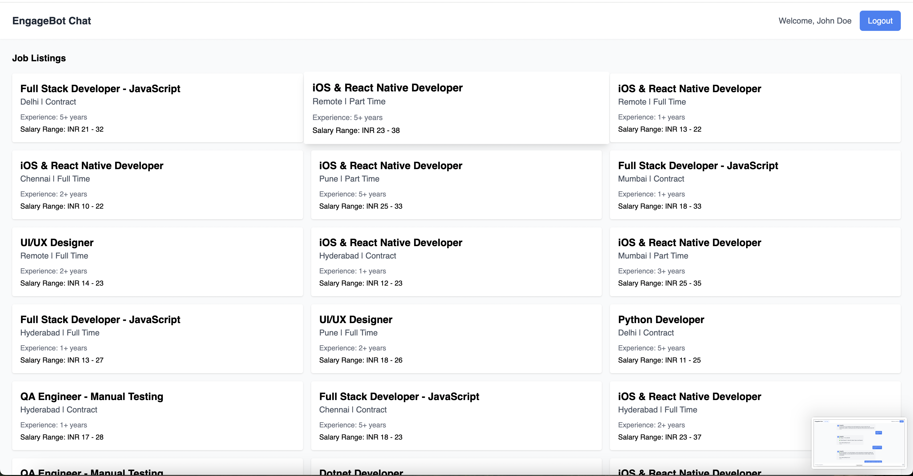
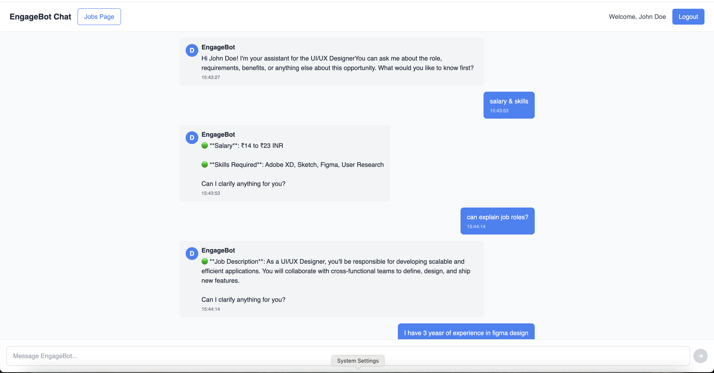

# 🧠 Node Chatbot Assignment

This project is a full-stack chatbot application featuring a Node.js backend and a React frontend. The bot supports messaging functionality and integrates with a MongoDB database to fetch job-related data.

---

## 📦 Backend Setup

1. **Navigate to the backend directory:**

   ```bash
   cd assignments-fullstack/node-chat-backend
   ```

2. **Install dependencies:**

   ```bash
   npm install
   ```

3. **Set up MongoDB:**

   * Create a database named `candidate_eg_chatbot`.

4. **Import job data:**

   * Use MongoDB CLI or Compass to import `Jobs.json` into the `jobs` collection.

   Example using CLI:

   ```bash
   mongoimport --db candidate_eg_chatbot --collection jobs --file path/to/Jobs.json --jsonArray
   ```

5. **Start the backend server:**

   ```bash
   npm run dev
   ```

   The backend server will run at:
   `http://localhost:3001`

---

## 🎨 Frontend Setup

1. **Navigate to the frontend directory:**

   ```bash
   cd assignments-fullstack/node-chat-frontend
   ```

2. **Install dependencies:**

   ```bash
   npm install
   ```

3. **Start the frontend server:**

   ```bash
   npm start
   ```

   The frontend server will run at:
   `http://localhost:3000`

---

## ✅ Additional Notes

* Ensure MongoDB is running locally before starting the backend server.
* Both frontend and backend need to be running for the chatbot to function correctly.
* The backend uses WebSockets (Socket.IO) to enable real-time chat features.

---

## 📂 Project Structure

```
assignments-fullstack/
│
├── node-chat-backend/      # Node.js + Express + MongoDB (backend)
│   ├── Jobs.json           # Sample job data
│   └── ...
│
├── node-chat-frontend/     # React app (frontend)
│   └── ...
```

---

## 📧 Contact

For questions or issues, feel free to reach out or open an issue in this repository.


## Chatbot UI Preview





